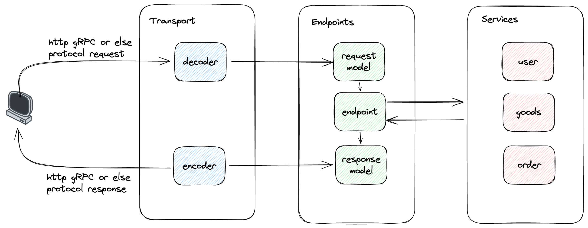

# 简介

[luchen](https://github.com/fengjx/luchen) 是一个基于 [go-kit](https://github.com/go-kit/kit) 二次封装的微服务框架。遵循 go-kit 的开发理念，集成了部分工程实践方案，并简化了使用方式。

> 开始这个项目的时候，我的女儿刚出生，取名【路辰】,这就是 luchen 的由来

## go-kit 是什么

[go-kit](https://github.com/go-kit/kit) 是一个微服务开发工具集，并不算一个完整的框架。根据工程实践总结的一套开发规范，解决分布式开发中的常见问题，它同样也适用于单体服务开发。

go-kit 的关注点是架构分层，关注点分离，通过代码分层来实现解耦，提高扩展性。

go-kit 基础概念

- Transport layer: 传输层，负责不同接入协议支撑（如：HTTP gRPC）和编解码工作
- Endpoint layer: 端点层，一个端点就是对外暴露的一个接口，处理 request model 并返回一个 response model
- Service layer: 业务逻辑层，处理业务逻辑，无需也不应该关心是哪种协议和编解码工作

具体可以查看：[go-kit 学习指南](https://blog.fengjx.com/pages/40737e/)

go-kit 相关文章

- [go-kit官方文档](https://gokit.io/faq/)
- [基于 Go-Kit 的 Golang 整洁架构实践](https://xie.infoq.cn/article/39599d1451711648f8f94030f)
