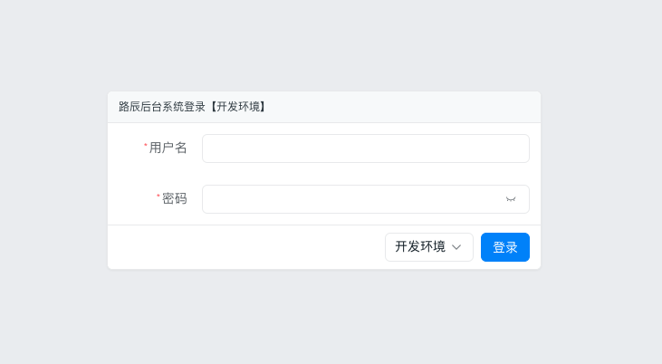

# 快速开始

## 环境安装

- [安装golang](https://go.dev/doc/install)
- [安装nodejs](https://nodejs.org/en/download/package-manager/current)
- <a href="/guide/lc" target="_blank">安装cli工具</a>

## 创建项目

```bash
lc start -m github.com/fengjx/lucky-demo --template lucky
```
> 文件目录默认按 gomod 创建，可以通过参数 -o 指定

## 初始化数据

创建数据库
```sql
create database lca default character set utf8mb4 collate utf8mb4_bin;
```

修改数据库配置 `conf/app.yml`

```yml
db:
  default:
    type: mysql
    # 修改为自己的数据库连接地址
    dsn: root:1234@tcp(localhost:3306)/lca?charset=utf8mb4,utf8&tls=false&timeout=10s&parseTime=true
    show-sql: true
    max-idle: 5
    max-conn: 10
```

```bash
cd lucky-demo
# 安装 go 依赖
go mod tidy
# 初始化数据
go run tools/init/main.go
```

## 启动后端工程

```bash
go run main.go
```

## 启动前端工程

```bash
# lc-halo-web 修改为你自己的项目名
git clone https://github.com/fengjx/lucky-web.git
cd lucky-web
pnpm i
pnpm run dev
```

## 访问服务

访问地址：<http://localhost:3001>

账号密码：lucky / luchen




